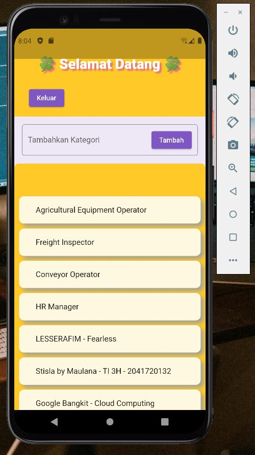
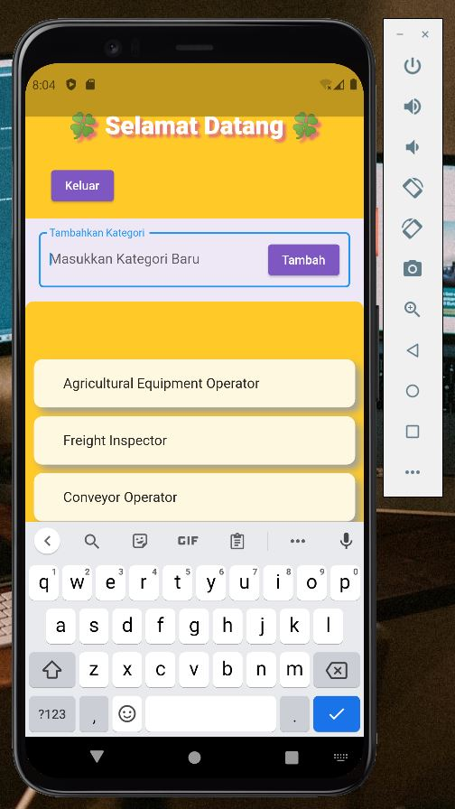
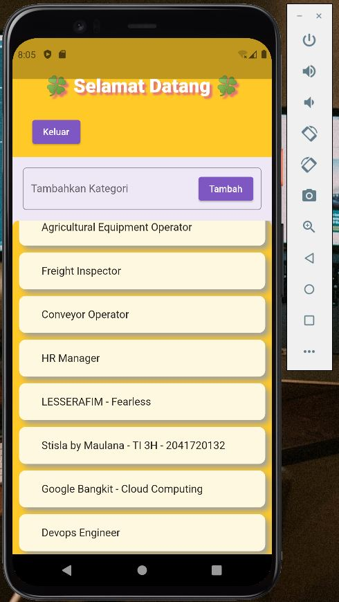
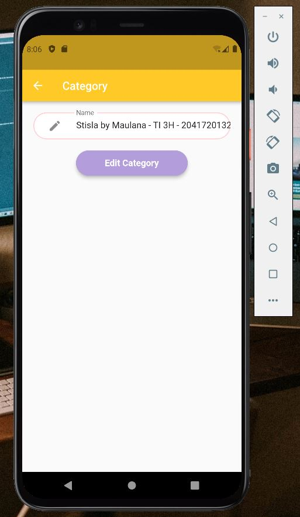
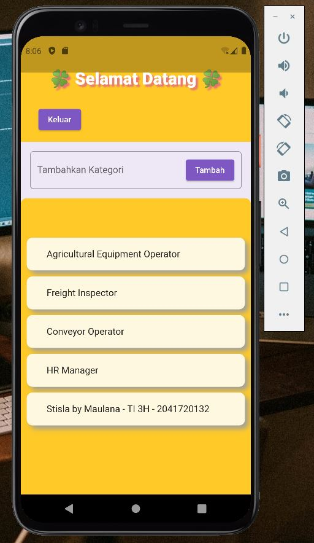
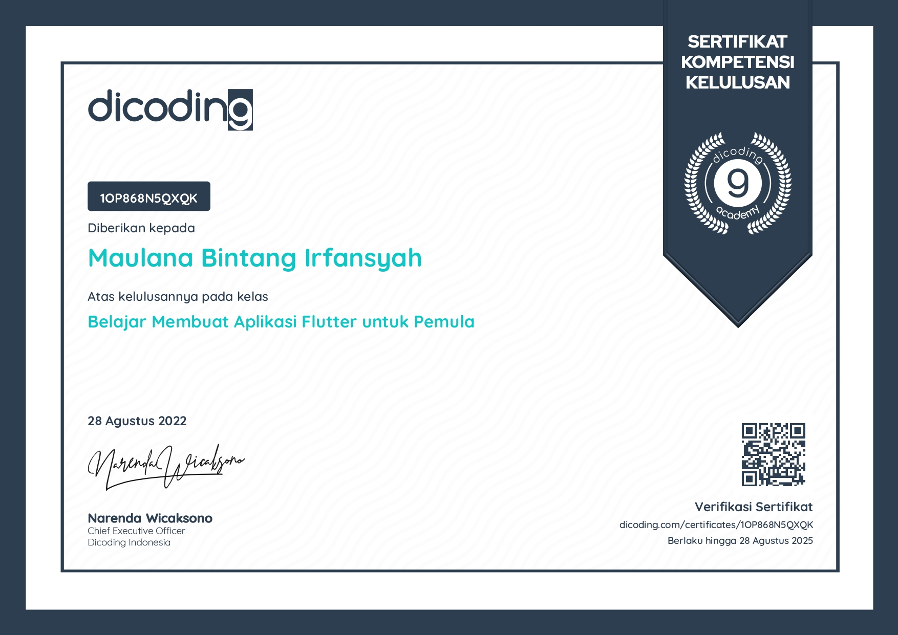

# Flutter-App-CRUD_API_Stisla-Maulana

NIM   : 2041720132  
Nama  : Maulana Bintang Irfansyah  
Kelas : TI-3H  
Prodi : D4 Teknik Informatika  

## Hasil UAS pada Android Emulator

 

 

 

 

 

 

## Hasil Kelas Dicoding - "Belajar Membuat Aplikasi Flutter untuk Pemula"
 

 

 

